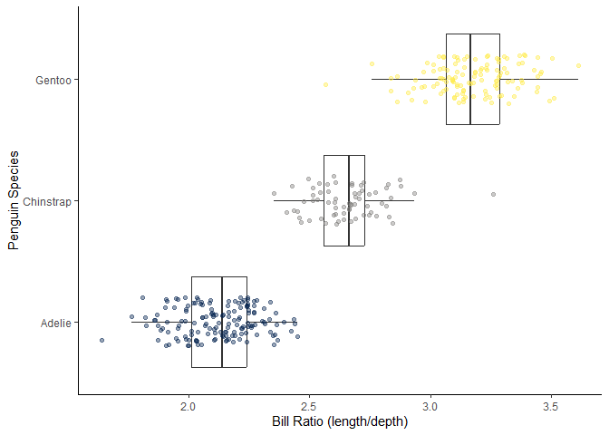
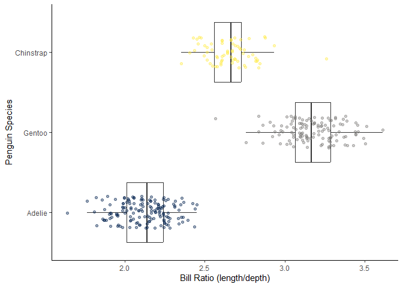
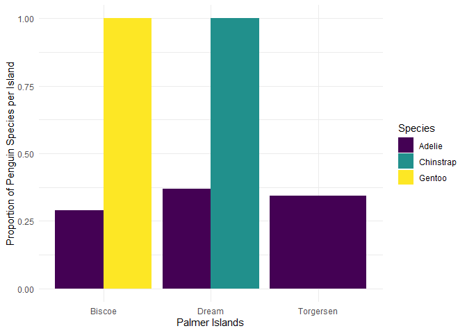

# Summarizing Penguins
Tyler Busby

<!-- If you work with a partner, please include their name with "author" above -->

## Goals for the Activity

1.  Use `mutate()`, `group_by()`, and `summarize()` to answer some
    questions about the penguins.  
2.  Learn a few other `dplyr` functions such as `drop_na()` and
    `count()` that can be used in summarizing data.  
3.  Learn the `dplyr` functions `case_when()` and `across()` to clean up
    and create new variables.  
4.  Connect summarized and created variables and graphics together to
    answer research questions.

**THROUGHOUT THE Activity** be sure to follow the Style Guide by doing
the following:

- load the appropriate packages at the beginning of the Quarto
  document  
- use proper spacing  
- name all code chunks  
- comment at least once in each code chunk to describe why you made your
  coding decisions  
- add appropriate labels to all graphic axes  
- use appropriate white space

## Create new variables with `mutate()`

Use `mutate()` to add a new column, while keeping the existing columns.
The general structure is:

``` r
df |>
  mutate(new_column_name = what_it_contains)
```

For example, if I had a data frame df with columns A and B, I can add a
new column C that is the sum of A and B as follows (note: you can also
use sum(A,B) here instead of A + B):

``` r
df |>
  mutate(C = A + B)
```

For example, we can convert body mass to kilograms:

``` r
penguins |>
  mutate(body_mass_kg = body_mass_g / 1000)
```

    # A tibble: 344 × 9
       species island    bill_length_mm bill_depth_mm flipper_length_mm body_mass_g
       <fct>   <fct>              <dbl>         <dbl>             <int>       <int>
     1 Adelie  Torgersen           39.1          18.7               181        3750
     2 Adelie  Torgersen           39.5          17.4               186        3800
     3 Adelie  Torgersen           40.3          18                 195        3250
     4 Adelie  Torgersen           NA            NA                  NA          NA
     5 Adelie  Torgersen           36.7          19.3               193        3450
     6 Adelie  Torgersen           39.3          20.6               190        3650
     7 Adelie  Torgersen           38.9          17.8               181        3625
     8 Adelie  Torgersen           39.2          19.6               195        4675
     9 Adelie  Torgersen           34.1          18.1               193        3475
    10 Adelie  Torgersen           42            20.2               190        4250
    # ℹ 334 more rows
    # ℹ 3 more variables: sex <fct>, year <int>, body_mass_kg <dbl>

Notice that for some variables we have `NA` listed for missing values.
We can use `drop_na()` to remove the missing values from those variables

``` r
penguins |> 
  drop_na() #if we leave it blank it will remove any row with an NA
```

    # A tibble: 333 × 8
       species island    bill_length_mm bill_depth_mm flipper_length_mm body_mass_g
       <fct>   <fct>              <dbl>         <dbl>             <int>       <int>
     1 Adelie  Torgersen           39.1          18.7               181        3750
     2 Adelie  Torgersen           39.5          17.4               186        3800
     3 Adelie  Torgersen           40.3          18                 195        3250
     4 Adelie  Torgersen           36.7          19.3               193        3450
     5 Adelie  Torgersen           39.3          20.6               190        3650
     6 Adelie  Torgersen           38.9          17.8               181        3625
     7 Adelie  Torgersen           39.2          19.6               195        4675
     8 Adelie  Torgersen           41.1          17.6               182        3200
     9 Adelie  Torgersen           38.6          21.2               191        3800
    10 Adelie  Torgersen           34.6          21.1               198        4400
    # ℹ 323 more rows
    # ℹ 2 more variables: sex <fct>, year <int>

``` r
penguins |> 
  drop_na(sex) #adding a variable, removes rows with NA just for that variable
```

    # A tibble: 333 × 8
       species island    bill_length_mm bill_depth_mm flipper_length_mm body_mass_g
       <fct>   <fct>              <dbl>         <dbl>             <int>       <int>
     1 Adelie  Torgersen           39.1          18.7               181        3750
     2 Adelie  Torgersen           39.5          17.4               186        3800
     3 Adelie  Torgersen           40.3          18                 195        3250
     4 Adelie  Torgersen           36.7          19.3               193        3450
     5 Adelie  Torgersen           39.3          20.6               190        3650
     6 Adelie  Torgersen           38.9          17.8               181        3625
     7 Adelie  Torgersen           39.2          19.6               195        4675
     8 Adelie  Torgersen           41.1          17.6               182        3200
     9 Adelie  Torgersen           38.6          21.2               191        3800
    10 Adelie  Torgersen           34.6          21.1               198        4400
    # ℹ 323 more rows
    # ℹ 2 more variables: sex <fct>, year <int>

### Evaluating the Bill Size

Create new variable called `bill_ratio` that is the ratio of length to
depth (length/depth)

``` r
penguins <- penguins |> 
  mutate(bill_ratio = bill_length_mm/bill_depth_mm) #create bill ratio variable using length/depth
```

Now create a boxplot of `bill_ratio` split by species. Be sure to add
labels to the axes. You can add other modifications if you want as well
(fill/color, theme, etc).

``` r
penguins |> #load penguin data
  ggplot(aes(x = bill_ratio, y = species)) + #create plot with x as bill ratio and y as species
  geom_boxplot(outliers = FALSE) + #create boxplot with no outliers
  geom_jitter(aes(color = species), #add a jitter plot with point color mapped to species
              height = 0.2, #decrease vertical range on points
              alpha = 0.4) + #decrease transparency
  guides(color = "none") + #remove legend for color
  scale_color_viridis_d(option = "cividis") + #change color pallate to cividis
  labs(x = "Bill Ratio (length/depth)", #change x-axis label
       y = "Penguin Species") + #change y-axis label
  theme_classic() #change theme of plot
```

    Warning: Removed 2 rows containing non-finite outside the scale range
    (`stat_boxplot()`).

    Warning: Removed 2 rows containing missing values or values outside the scale range
    (`geom_point()`).



Add three new columns to penguins within one `mutate()` function: one
column that contains the bill ratio (bill length / bill depth), one that
contains the body mass converted to kg, and one that contains the
flipper length converted to meters.

``` r
"create-3-variables"
```

    [1] "create-3-variables"

``` r
penguins <- penguins |>
  mutate(bill_ratio = bill_length_mm/bill_depth_mm, #create bill ratio variable using length/depth
         body_mass_kg = body_mass_g/1000, #create body mass variable in kg
         flipper_length_m = flipper_length_mm/1000) #create flipper length variable in m
```

We can also use `mutate()` to modify an existing variable. By default, R
reports factors in alphabetical order (you may notice in your boxplot
they always print in the same order, Adelie, Chinstrap, Gentoo). If we
want to reorder, we can use a function `fct_relevel()` from the
`forcats` package, which we will learn about in a few weeks. Modify the
code below to calculate the `bill_ratio` and then recreate the boxplot
from above by species - how does it differ?

``` r
penguins |> 
  mutate(species = 
           fct_relevel(species, "Adelie", "Gentoo", "Chinstrap"),
         bill_ratio = bill_length_mm/bill_depth_mm) |> 
  ggplot(aes(x = bill_ratio, y = species)) + #create plot with x as bill ratio and y as species
  geom_boxplot(outliers = FALSE) + #create boxplot with no outliers
  geom_jitter(aes(color = species), #add a jitter plot with point color mapped to species
              height = 0.2, #decrease vertical range on points
              alpha = 0.4) + #decrease transparency
  guides(color = "none") + #remove legend for color
  scale_color_viridis_d(option = "cividis") + #change color pallate to cividis
  labs(x = "Bill Ratio (length/depth)", #change x-axis label
       y = "Penguin Species") + #change y-axis label
  theme_classic() #change theme of plot
```

    Warning: Removed 2 rows containing non-finite outside the scale range
    (`stat_boxplot()`).

    Warning: Removed 2 rows containing missing values or values outside the scale range
    (`geom_point()`).



## Summarize data using `group_by()` and `summarize()`

Use the combination of `group_by()` and `summarize()` to find find
summary statistics for different groups, and put them in a nice table.

`group_by()` “takes an existing table and converts it into a grouped
table where operations are performed ‘by group’”

`summarize()` “creates a new data frame. It will have one (or more) rows
for each combination of grouping variables; if there are no grouping
variables, the output will have a single row summarizing all
observations in the input. It will contain one column for each grouping
variable and one column for each of the summary statistics that you have
specified”

For example, we can calculate the mean and standard deviation for body
mass:

``` r
penguins |>
  group_by(species) |>
  summarize(mass_mean = mean(body_mass_g, na.rm = TRUE),
            mass_sd = sd(body_mass_g, na.rm = TRUE))
```

    # A tibble: 3 × 3
      species   mass_mean mass_sd
      <fct>         <dbl>   <dbl>
    1 Adelie        3701.    459.
    2 Chinstrap     3733.    384.
    3 Gentoo        5076.    504.

Note, that `na.rm = TRUE` removes NA from the calculations instead of
removing them from the data like `drop_na()`. Often, errors reported
with `mean()` and similar functions are because there are `NA` in the
data.

Second Note, if you use `mosaic` in your statistics class, note that
`mean()` used here is from base R, so there is no `~` in front of the
variable. If you wanted to use `mosaic` you can, you will just need to
modify the syntax:

- Base R: `mean(x)`  
- Mosaic: `mean(~x)`

### Group by Species and Sex

Find the mean and standard deviation of body mass in *kilograms* by
species and sex.

``` r
penguins |> #load penguin data
  drop_na(species, sex) |> #remove species and sex variables marked as NA
  mutate(body_mass_kg = body_mass_g/1000) |> #create body mass variable in kg 
  group_by(species, sex) |> #groups variables by species and sex
  summarize(mass_mean_kg = mean(body_mass_kg, na.rm = TRUE), #calculate mean body mass in kg
            mass_sd_kg = sd(body_mass_kg, na.rm = TRUE)) #calculate standard deviation body mass in kg
```

    `summarise()` has grouped output by 'species'. You can override using the
    `.groups` argument.

    # A tibble: 6 × 4
    # Groups:   species [3]
      species   sex    mass_mean_kg mass_sd_kg
      <fct>     <fct>         <dbl>      <dbl>
    1 Adelie    female         3.37      0.269
    2 Adelie    male           4.04      0.347
    3 Chinstrap female         3.53      0.285
    4 Chinstrap male           3.94      0.362
    5 Gentoo    female         4.68      0.282
    6 Gentoo    male           5.48      0.313

Starting with penguins, create a summary table containing the maximum
and minimum length of flippers (call the columns flip_max and flip_min)
for just Chinstrap penguins, grouped by island. (Hint - remember
`filter()`)

``` r
penguins |>
  filter(species == "Chinstrap") |> #select only Chinstrap
  group_by(island) |> #group by island
  summarize(flip_max = max(flipper_length_mm), #calculate flipper max variable
            flip_min = min(flipper_length_mm)) #calculate flipper min variable
```

    # A tibble: 1 × 3
      island flip_max flip_min
      <fct>     <int>    <int>
    1 Dream       212      178

Starting with penguins, in a piped sequence:

- Add a new column called bill_ratio that is the ratio of bill length to
  bill depth (hint: mutate())  
- Only keep columns species and bill_ratio  
- Group the data by species  
- Create a summary table containing the mean of the bill_ratio variable,
  by species (name the column in the summary table bill_ratio_mean)

``` r
penguins |> 
  mutate(bill_ratio = bill_length_mm/bill_depth_mm) |> #create bill ratio variable
  select(species, bill_ratio) |> #only keep species and bill ratio columns
  group_by(species) |> #group by species
  summarize(bill_ratio_mean = mean(bill_ratio, na.rm = TRUE)) #find mean bill ratio
```

    # A tibble: 3 × 2
      species   bill_ratio_mean
      <fct>               <dbl>
    1 Adelie               2.12
    2 Chinstrap            2.65
    3 Gentoo               3.18

## New function `across()`

The `across()` function is especially useful within `summarize()` to
efficiently create summary tables with one or more functions applied to
multiple variables (columns).

Let’s compare two ways of doing the same thing: creating a summary table
of mean values for all penguin size measurements ending in “mm” (bill
depth, bill length, flipper length), by species.

Approach 1:

``` r
penguins |>
  group_by(species) |> 
  summarize(bill_length_mean = mean(bill_length_mm, na.rm = TRUE),
            bill_depth_mean = mean(bill_depth_mm, na.rm = TRUE),
            flipper_length_mean = mean(flipper_length_mm, na.rm = TRUE))
```

    # A tibble: 3 × 4
      species   bill_length_mean bill_depth_mean flipper_length_mean
      <fct>                <dbl>           <dbl>               <dbl>
    1 Adelie                38.8            18.3                190.
    2 Chinstrap             48.8            18.4                196.
    3 Gentoo                47.5            15.0                217.

Approach 2:

``` r
penguins |>
  group_by(species) |>
  summarize(across(ends_with("mm"), 
                   .fns = mean, 
                   na.rm = TRUE))
```

    Warning: There was 1 warning in `summarize()`.
    ℹ In argument: `across(ends_with("mm"), .fns = mean, na.rm = TRUE)`.
    ℹ In group 1: `species = Adelie`.
    Caused by warning:
    ! The `...` argument of `across()` is deprecated as of dplyr 1.1.0.
    Supply arguments directly to `.fns` through an anonymous function instead.

      # Previously
      across(a:b, mean, na.rm = TRUE)

      # Now
      across(a:b, \(x) mean(x, na.rm = TRUE))

    # A tibble: 3 × 4
      species   bill_length_mm bill_depth_mm flipper_length_mm
      <fct>              <dbl>         <dbl>             <dbl>
    1 Adelie              38.8          18.3              190.
    2 Chinstrap           48.8          18.4              196.
    3 Gentoo              47.5          15.0              217.

We can modify multiple names by appending something to the beginning

``` r
penguins |>
  group_by(year) |>
  summarise(across(starts_with("bill"), 
                   .fns = max, 
                   na.rm = TRUE, 
                   .names = "max_{.col}"))
```

    # A tibble: 3 × 4
       year max_bill_length_mm max_bill_depth_mm max_bill_ratio
      <int>              <dbl>             <dbl>          <dbl>
    1  2007               59.6              21.5           3.51
    2  2008               54.3              21.1           3.46
    3  2009               55.9              20.7           3.61

or ending of the column name:

``` r
penguins |>
  group_by(year) |>
  summarise(across(starts_with("bill"), 
                   .fns = max, 
                   na.rm = TRUE, 
                   .names = "{.col}_max"))
```

    # A tibble: 3 × 4
       year bill_length_mm_max bill_depth_mm_max bill_ratio_max
      <int>              <dbl>             <dbl>          <dbl>
    1  2007               59.6              21.5           3.51
    2  2008               54.3              21.1           3.46
    3  2009               55.9              20.7           3.61

Starting from penguins, create a summary table that finds the mean and
standard deviation for all variables containing the string “length”,
grouped by penguin species. Update the column names to start with
“avg\_” or “sd\_”, followed by the original column names.

There’s quite a bit happening here, so a little breakdown:

- We use `contains("length")` to indicate we’ll apply the functions to
  any columns with the word “length” in the name  
- Within `list()` is where the functions to be applied across columns
  are given, and where their “names” of “avg” and “stdev” are set  
- We use `.names =` to define the final column names in the summary
  table. Here, the name should start with the function “name” specified
  above (“avg” or “stdev”), then an underscore, then the original column
  name (that’s what `"{.fn}_{.col}"` will do)

``` r
penguins |>
  group_by(species) |>
  summarize(across(contains("length"),
                   list(avg = mean, stdev = sd),
                   na.rm = TRUE,
                   .names = "{.fn}_{.col}"))
```

    # A tibble: 3 × 7
      species   avg_bill_length_mm stdev_bill_length_mm avg_flipper_length_mm
      <fct>                  <dbl>                <dbl>                 <dbl>
    1 Adelie                  38.8                 2.66                  190.
    2 Chinstrap               48.8                 3.34                  196.
    3 Gentoo                  47.5                 3.08                  217.
    # ℹ 3 more variables: stdev_flipper_length_mm <dbl>,
    #   avg_flipper_length_m <dbl>, stdev_flipper_length_m <dbl>

### Practice with `across()`

Starting with penguins, group data by island then use `across()` to find
the median value of groups for any columns containing the string “mm”.

Bonus Point: The names in the resulting table should be the original
column name followed by an underscore, then the word “median”
(e.g. `colname_median`).

``` r
penguins |>
  group_by(island) |> #group by island
  summarize(across(ends_with("mm"), #select columns ending with "mm"
                   .fns = median, #calculate median for each
                   na.rm = TRUE, #remove NA variables
                   .names = "{.col}_median")) #set names as "colname_median"
```

    # A tibble: 3 × 4
      island    bill_length_mm_median bill_depth_mm_median flipper_length_mm_median
      <fct>                     <dbl>                <dbl>                    <dbl>
    1 Biscoe                     45.8                 15.5                      214
    2 Dream                      44.7                 18.4                      193
    3 Torgersen                  38.9                 18.4                      191

Starting from penguins, write a piped sequence to:

- Exclude penguins observed on Biscoe Island  
- Only keep variables species through `body_mass_g`  
- Rename the species variable to `spp_penguin`  
- Group the data by `spp_penguin`  
- Find the mean value for any variable containing the string “length”,
  by penguin species, with column names updated to the original column
  name appended with “\_mean” at the end

``` r
penguins |>
  filter(island != "Biscoe") |> #remove penguins on Biscoe Island
  select(1:6) |> #only keep variables species through body mass
  rename("spp_penguin" = species) |> #rename species variable to "spp_penguin"
  group_by(spp_penguin) |> #group by species
  summarize(across(contains("length"), #select columns with "length"
                   .fns = mean, #calculate mean for each
                   na.rm = TRUE, #remove NA variables
                   .names = "{.col}_mean")) #set names as "colname_mean"
```

    # A tibble: 2 × 3
      spp_penguin bill_length_mm_mean flipper_length_mm_mean
      <fct>                     <dbl>                  <dbl>
    1 Adelie                     38.7                   190.
    2 Chinstrap                  48.8                   196.

## New Function `count()`

The `dplyr::count()` function wraps a bunch of things into one beautiful
friendly line of code to help you find counts of observations by group.
To demonstrate what it does, let’s find the counts of penguins in the
penguins dataset by species in two different ways:

- Using `group_by() |> summarize()` with `n()` to count observations  
- Using `count()` to do the exact same thing

``` r
penguins |>
  group_by(species) |>
  summarize(n = n())
```

    # A tibble: 3 × 2
      species       n
      <fct>     <int>
    1 Adelie      152
    2 Chinstrap    68
    3 Gentoo      124

``` r
penguins |>
  count(species)
```

    # A tibble: 3 × 2
      species       n
      <fct>     <int>
    1 Adelie      152
    2 Chinstrap    68
    3 Gentoo      124

For example, what does the following code do?

``` r
penguins |>
  count(species, year) #counts number of penguins by species and year
```

    # A tibble: 9 × 3
      species    year     n
      <fct>     <int> <int>
    1 Adelie     2007    50
    2 Adelie     2008    50
    3 Adelie     2009    52
    4 Chinstrap  2007    26
    5 Chinstrap  2008    18
    6 Chinstrap  2009    24
    7 Gentoo     2007    34
    8 Gentoo     2008    46
    9 Gentoo     2009    44

We can combine `count()` with `mutate()` to find proportions and the
visualize them - comment the following code:

``` r
penguins |> 
  count(species, island) |> #counts number of penguins by species and island
  group_by(species) |> #groups by species 
  mutate(total = sum(n),  #creates variable total for each species and island group
         prop = n/total) |>  #creates variable prop for each species and island group
  ggplot(aes(x = island, y = prop, fill = species)) + #creates plot with x mapped to island, y mapped to prop, and color mapped to species
  geom_col(position = position_dodge()) + #sets column position to dodged
  scale_fill_viridis_d() + #changes color scale to viridis color pallatte
  labs(x = "Palmer Islands", #changes x-axis label
       y = "Proportion of Penguin Species per Island", #changes y-axis label
       fill = "Species") + #changes color's legend's label
  theme_minimal() #changes theme to minimal
```



### Practice with `count()`

Starting with penguins, find counts of observation by species, island,
and year.

``` r
penguins |> 
  count(species, island, year) #counts number of penguins by species, island, and year
```

    # A tibble: 15 × 4
       species   island     year     n
       <fct>     <fct>     <int> <int>
     1 Adelie    Biscoe     2007    10
     2 Adelie    Biscoe     2008    18
     3 Adelie    Biscoe     2009    16
     4 Adelie    Dream      2007    20
     5 Adelie    Dream      2008    16
     6 Adelie    Dream      2009    20
     7 Adelie    Torgersen  2007    20
     8 Adelie    Torgersen  2008    16
     9 Adelie    Torgersen  2009    16
    10 Chinstrap Dream      2007    26
    11 Chinstrap Dream      2008    18
    12 Chinstrap Dream      2009    24
    13 Gentoo    Biscoe     2007    34
    14 Gentoo    Biscoe     2008    46
    15 Gentoo    Biscoe     2009    44

Starting with penguins, filter to only keep Adelie and Gentoo penguins,
then find counts by species and sex.

``` r
penguins |> 
  drop_na(species, sex) |> #remove NAs for species and sex
  filter(species == c("Adelie", "Gentoo")) |> #keep only Adelie and Gentoo penguins
  count(species, sex) #counts number of penguins by species and sex
```

    Warning: There were 2 warnings in `filter()`.
    The first warning was:
    ℹ In argument: `species == c("Adelie", "Gentoo")`.
    Caused by warning in `==.default`:
    ! longer object length is not a multiple of shorter object length
    ℹ Run `dplyr::last_dplyr_warnings()` to see the 1 remaining warning.

    # A tibble: 4 × 3
      species sex        n
      <fct>   <fct>  <int>
    1 Adelie  female    54
    2 Adelie  male      19
    3 Gentoo  female    28
    4 Gentoo  male      31

## New Function `case_when()`

The `case_when()` function is like a really friendly if-else statement.
When used within `mutate()`, it allows you to add a new column
containing values dependent on your condition(s).

To penguins, add a new column size_bin that contains:

- “large” if body mass is greater than 4500 g  
- “medium” if body mass is greater than 3000 g, and less than or equal
  to 4500 g  
- “small” if body mass is less than or equal to 3000 g

``` r
penguins |>
  mutate(size_bin = case_when(
      body_mass_g > 4500 ~ "large",
      body_mass_g > 3000 & body_mass_g <= 4500 ~ "medium",
      body_mass_g <= 3000 ~ "small"
    )
  )
```

    # A tibble: 344 × 12
       species island    bill_length_mm bill_depth_mm flipper_length_mm body_mass_g
       <fct>   <fct>              <dbl>         <dbl>             <int>       <int>
     1 Adelie  Torgersen           39.1          18.7               181        3750
     2 Adelie  Torgersen           39.5          17.4               186        3800
     3 Adelie  Torgersen           40.3          18                 195        3250
     4 Adelie  Torgersen           NA            NA                  NA          NA
     5 Adelie  Torgersen           36.7          19.3               193        3450
     6 Adelie  Torgersen           39.3          20.6               190        3650
     7 Adelie  Torgersen           38.9          17.8               181        3625
     8 Adelie  Torgersen           39.2          19.6               195        4675
     9 Adelie  Torgersen           34.1          18.1               193        3475
    10 Adelie  Torgersen           42            20.2               190        4250
    # ℹ 334 more rows
    # ℹ 6 more variables: sex <fct>, year <int>, bill_ratio <dbl>,
    #   body_mass_kg <dbl>, flipper_length_m <dbl>, size_bin <chr>

### Practice with `case_when()`

Identify what is going on in this code:

``` r
penguins |>
  select(species, year, flipper_length_mm) |>  #keep only species, year, and flipper length variables
  rename(study_year = year) |>   #rename year variable to study_year
  filter(species == "Adelie") |>  #select only Adelie penguin species
  mutate(flipper_rank = case_when(   #create flipper rank variable
    flipper_length_mm < 200 ~ 1,   #set lengths less than 200 to 1
    flipper_length_mm >= 200 ~ 2,  #set lengths greater than or equal to 200 to 2
    TRUE ~ 0 # 0 for anything else
  ))
```

    # A tibble: 152 × 4
       species study_year flipper_length_mm flipper_rank
       <fct>        <int>             <int>        <dbl>
     1 Adelie        2007               181            1
     2 Adelie        2007               186            1
     3 Adelie        2007               195            1
     4 Adelie        2007                NA            0
     5 Adelie        2007               193            1
     6 Adelie        2007               190            1
     7 Adelie        2007               181            1
     8 Adelie        2007               195            1
     9 Adelie        2007               193            1
    10 Adelie        2007               190            1
    # ℹ 142 more rows

Add a new column to penguins called study_year that contains:

- “Year 1” if the year is 2007  
- “Year 2” if the year is 2008  
- “Year 3” if the year is 2009

``` r
penguins |>
  mutate(study_year = case_when(   #create study_year variable
    year == 2007 ~ "Year 1",   #set year 2007 to Year 1
    year == 2008 ~ "Year 2",   #set year 2008 to Year 2
    year == 2009 ~ "Year 3"   #set year 2009 to Year 3
  ))
```

    # A tibble: 344 × 12
       species island    bill_length_mm bill_depth_mm flipper_length_mm body_mass_g
       <fct>   <fct>              <dbl>         <dbl>             <int>       <int>
     1 Adelie  Torgersen           39.1          18.7               181        3750
     2 Adelie  Torgersen           39.5          17.4               186        3800
     3 Adelie  Torgersen           40.3          18                 195        3250
     4 Adelie  Torgersen           NA            NA                  NA          NA
     5 Adelie  Torgersen           36.7          19.3               193        3450
     6 Adelie  Torgersen           39.3          20.6               190        3650
     7 Adelie  Torgersen           38.9          17.8               181        3625
     8 Adelie  Torgersen           39.2          19.6               195        4675
     9 Adelie  Torgersen           34.1          18.1               193        3475
    10 Adelie  Torgersen           42            20.2               190        4250
    # ℹ 334 more rows
    # ℹ 6 more variables: sex <fct>, year <int>, bill_ratio <dbl>,
    #   body_mass_kg <dbl>, flipper_length_m <dbl>, study_year <chr>

Starting with penguins, only keep observations for chinstrap penguins,
then only keep the `flipper_length_mm` and `body_mass_g` variables. Add
a new column called `fm_ratio` that contains the ratio of flipper length
to body mass for each penguin. Next, add another column named
`ratio_bin` which contains the word “high” if `fm_ratio` is greater than
or equal to 0.05, “low” if the ratio is less than 0.05, and “no record”
if anything else (e.g. NA).

``` r
penguins |>
  filter(species == "Chinstrap") |> #select only Chinstrap penguin species
  select(flipper_length_mm, body_mass_g) |> #select only flipper length and body mass columns
  mutate(fm_ratio = flipper_length_mm/body_mass_g, #create fm_ratio variable
         ratio_bin = case_when( #create ratio_bin variable
           fm_ratio >= 0.05 ~ "high", #set high for fm_ratio greater than or equal to 0.05
           fm_ratio < 0.05 ~ "low", #set low for fm_ratio less than 0.05
           TRUE ~ "no record" #no record for anything else
  ))
```

    # A tibble: 68 × 4
       flipper_length_mm body_mass_g fm_ratio ratio_bin
                   <int>       <int>    <dbl> <chr>    
     1               192        3500   0.0549 high     
     2               196        3900   0.0503 high     
     3               193        3650   0.0529 high     
     4               188        3525   0.0533 high     
     5               197        3725   0.0529 high     
     6               198        3950   0.0501 high     
     7               178        3250   0.0548 high     
     8               197        3750   0.0525 high     
     9               195        4150   0.0470 low      
    10               198        3700   0.0535 high     
    # ℹ 58 more rows

## Wrapping Up

The biggest challenge with data wrangling is figuring out what you want
to do first and then thinking about how the vocabulary translates to the
code. Once you know *what* you want to do, it is much easier to look up
*how* to do it!
